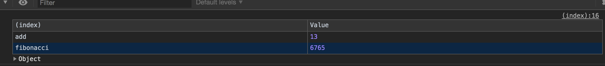

# Hello world wasm with rust

## setup

```bash
rustup default nightly
rustup update

rustup target add wasm32-unknown-unknown
```

## Create new project

```
cargo new --lib hello-world
```

## Build

```
cargo build --target wasm32-unknown-unknown
```

## Run server

```bash
python3 -m http.server
```

## Result



# Reference

* [Rust and WebAssembly - Introduction | dev.to](https://dev.to/sendilkumarn/rust-and-webassembly-for-masses-introduction-1034)